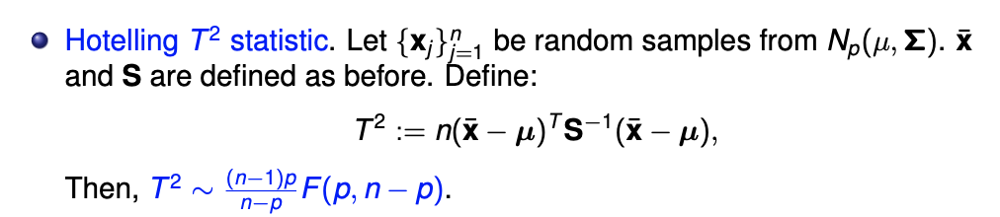
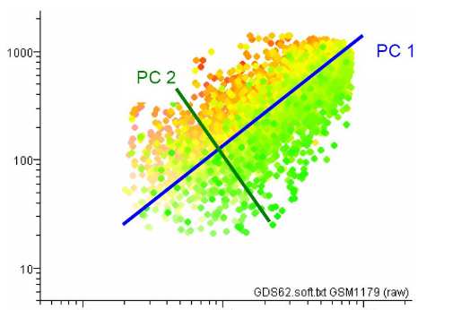
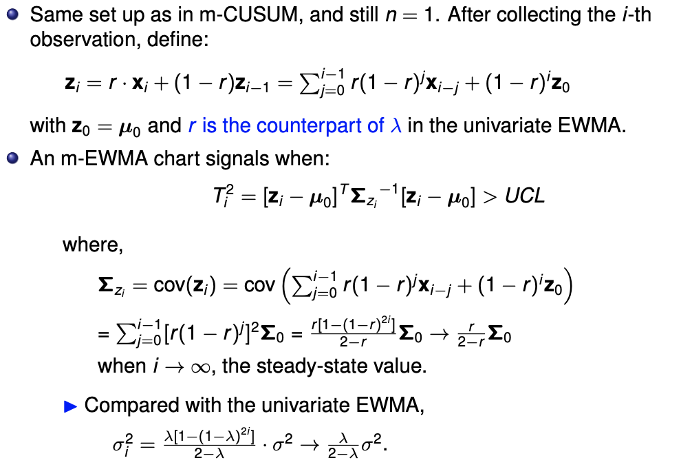
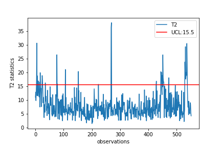
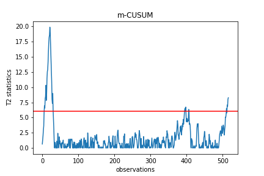

# Phase 1 analysis and building SPC chart
---
> _For data that with unknown population meean and variance, the process of finding its true mean/var is so called Phase 1 analysis_. 

The goal of this repo :
- Write a algorithm that is able to detect ouliers from a multivariate dataset based on __Hotelling $T^2$ statistics, m-CUSUM, and m-EWMA chart__ .
- Building SPC chart to monitor future data.

# Data Descripton
---
- This is a manufacturing related dataset, and it has a total of 552 data records.
- Each row is a data record. Each data record contains 209 values.
- This is a multivariate detection dataset in which 𝑝 = 209. The sample size is 𝑛 = 1.
- The physical meaning of each value is omitted.

# Procedure
---
-  PCA, reduce dimension of the dataset, avoid curse of dimesionality.
-  Hotelling $T^2$ test for phase 1 analysis, we use $T^2$ to plot SPC in order to remove outliers (out of 3once we remove oulier and get population mean/var, SPC will able to be build.
- Multi-variate chart like CUSUM or EWMA are also implemented to do outlier removal in case that $T^2$ missed some small shiftment.

    >In a high dimension, the noise components can add up to a great magnitude, even if individual ones are relatively small. As a result, the aggregated noise effect can overwhelm the signal effects and makes it harder to reject the null hypothesis. This is known as "curse of dimensionality."

# Mathematics
---
## 1.Hotelling $T^2$
- Hotelling $T^2$ statistics can be think as a __multivariate data__ version of _**t**_ statistic. As we know that T-test is used to compare difference between two univariate data set
- A conclude table of all kinds of T-test:     

| Data Type    | Comparsion     | Test Method     |
|--------------|----------------|-----------------|
| Univariate   | one pair       | T statistic          |
| Univariate   | multiple pairs | Tuckey's Method |
| Mulitvariate | one pair       | Hotelling $T^2$ |


Form of $T^2$:

>

- After we have $T^2$, we can lookup to F-dist table to find certain upper/lower control limits. where n = observations, p = dimension.

- Code implement:
```python
# covariance matrix of trimmed dataset
cov_mat=np.cov(X_pca.T)
cov_mat_inv=np.linalg.inv(cov_mat)
# X bar matrix
X_bar=[X_pca[:,i].mean() for i in range(0,pca_num)]
# calculating X_j-X_bar
X_sub=[X_pca[i,:]-X_bar for i in range(len(X_pca))]
X_sub=np.asmatrix(X_sub)
# calculating T^2 statistics
T_square=[np.float(np.matmul(np.matmul(X_sub[i,:],cov_mat_inv),X_sub[i,:].T)) for i in range(len(X_sub))]
```

## 2.PCA 
- The Basic idea of PCA is simple, it is trying to find **_Vital View_** instead of **_Trivial Many_** , if we put things into a 2D chart, the axis with highest variance is the vital view since it contains more information.


## 3.m-CUSUM
- The small m implies multivariate


## 4.m-EWMA



# Result
---
- 1. PCA 
Varaice explain ratio, use for chose pc numbers

Scree plot 

- 2. $T^2$

After removing outliers

- 3. Use m-Cusum to verified again
